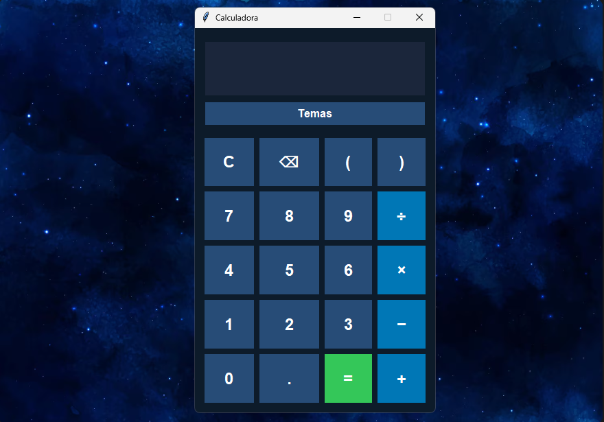

# 🧮 Calculadora Python

Uma calculadora gráfica desenvolvida em Python utilizando Tkinter.

O projeto possui uma interface simples e moderna, suporte ao teclado e diferentes temas visuais.
## 🖥️ Preview




- ➕ Adição
- ➖ Subtração
- ✖️ Multiplicação
- ➗ Divisão
- 🔢 Números decimais
- 🧮 Parênteses
- ⌫ Botão para apagar
- 🧹 Botão para limpar
- ⌨️ Suporte ao teclado
- 🎨 6 temas diferentes
- 💾 Salvamento automático do tema escolhido
- ⚠️ Tratamento de divisão por zero

## 🎨 Temas

A calculadora possui os seguintes temas:

- ⚫ Preto
- 🔴 Vermelho
- ⚪ Branco
- 🟡 Amarelo
- 🔵 Azul
- 🟢 Verde

O tema escolhido é salvo automaticamente e carregado quando a calculadora é aberta novamente.

## 🛠️ Tecnologias

- Python
- Tkinter

## ▶️ Como executar

É necessário ter Python instalado.

Execute:

```bash
python calculadora_v2.py👨‍💻 Autor

Weverton

Projeto desenvolvido para aprendizado e prática de programação em Python.